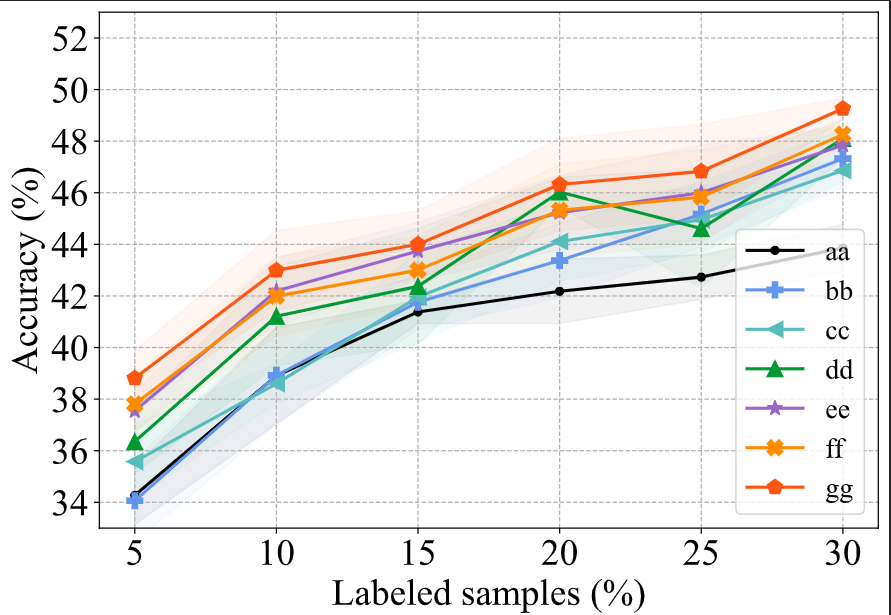
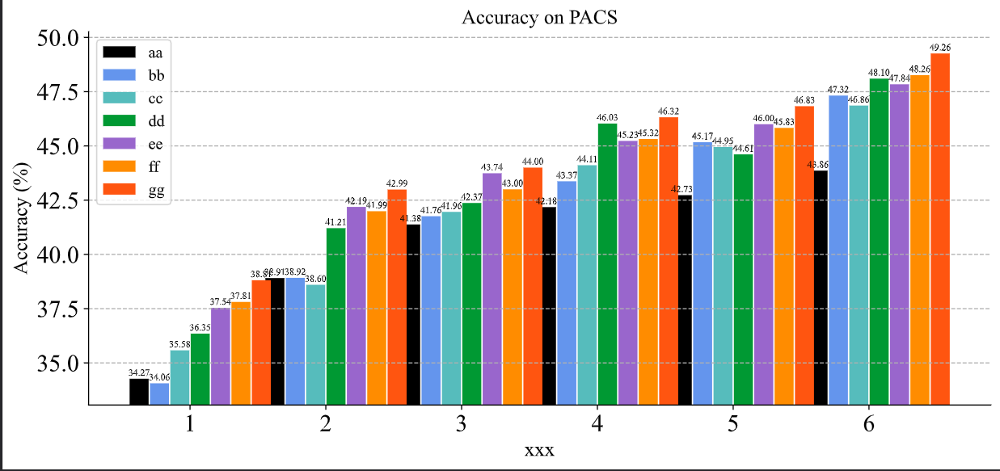
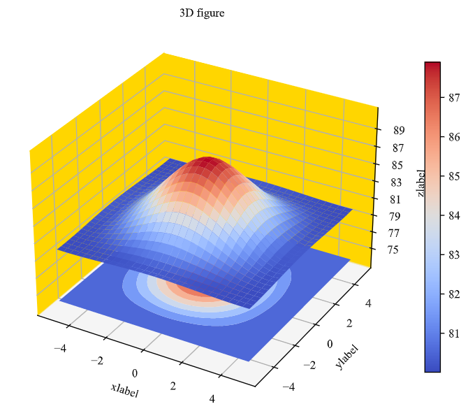
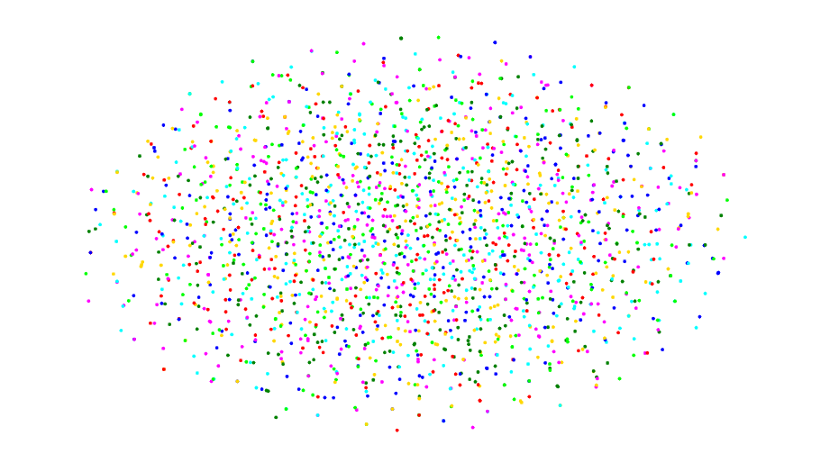

# DrawingTool
 Drawing tool for research.

# run
``` bash
cd draw
python line.py
python histogram.py
python surface.py
python tsne.py
```

# examples
* line

* histogram

* surface

* tsne


# Matplotlib优秀教程
* [宏观概述matplotlib几大控件](https://www.jianshu.com/p/3937798d645b)
## 3D画图
* [3D画图坐标问题](https://blog.csdn.net/lllxxq141592654/article/details/81532855)
* [3D画图中文教程](https://www.cnblogs.com/xingshansi/p/6777945.html)
* [3D画图官网教程](https://matplotlib.org/2.0.2/mpl_toolkits/mplot3d/tutorial.html)
* [3D画图内置colormap](https://matplotlib.org/stable/tutorials/colors/colormaps.html)
* [3D画图自定义colormap](https://zhuanlan.zhihu.com/p/141251520)
## 控件
* [colorbar控件详解1](https://zhajiman.github.io/post/matplotlib_colorbar、#:~:text=%E6%89%80%E8%B0%93%20colorbar%20%E5%8D%B3%E4%B8%BB%E5%9B%BE%E6%97%81%E4%B8%80%E4%B8%AA%E9%95%BF%E6%9D%A1%E7%8A%B6%E7%9A%84%E5%B0%8F%E5%9B%BE%EF%BC%8C%E8%83%BD%E5%A4%9F%E8%BE%85%E5%8A%A9%E8%A1%A8%E7%A4%BA%E4%B8%BB%E5%9B%BE%E4%B8%AD%20colormap%20%E7%9A%84%E9%A2%9C%E8%89%B2%E7%BB%84%E6%88%90%E5%92%8C%E9%A2%9C%E8%89%B2%E4%B8%8E%E6%95%B0%E5%80%BC%E7%9A%84%E5%AF%B9%E5%BA%94%E5%85%B3%E7%B3%BB%E3%80%82%20%E6%9C%AC%E6%96%87%E5%B0%86%E4%BC%9A%E4%BE%9D%E6%AC%A1%E4%BB%8B%E7%BB%8D,colorbar%20%E7%9A%84%E5%9F%BA%E6%9C%AC%E7%94%A8%E6%B3%95%E3%80%81%E5%A6%82%E4%BD%95%E8%AE%BE%E7%BD%AE%E5%88%BB%E5%BA%A6%EF%BC%8C%E4%BB%A5%E5%8F%8A%E6%80%8E%E4%B9%88%E4%B8%BA%E7%BB%84%E5%9B%BE%E6%B7%BB%E5%8A%A0%20colorbar%E3%80%82%20%E4%BB%A3%E7%A0%81%E5%9F%BA%E4%BA%8E%20Matplotlib%203.3.4%E3%80%82)
* [colorbar控件详解2](https://cloud.tencent.com/developer/article/1790249)